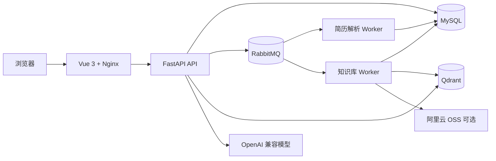

# AI 面试训练平台

面向技术求职者的全栈 AI 面试训练平台。用户可以导入简历和职位描述，生成针对目标岗位的面试计划，在多轮问答和动态追问中接受逐题评分，并通过能力报告与专项练习持续改善薄弱项。

项目包含完整的 Vue 前端、FastAPI 后端、异步任务 Worker、MySQL、RabbitMQ、Qdrant 和 Nginx 配置，可通过 Docker Compose 在一台 Linux 服务器上部署。

## 核心功能

### 个性化面试准备

- 注册、登录、会话续期和个人求职画像；
- 上传简历，由异步 Worker 调用模型解析并结构化保存；
- 解析职位描述（JD），提取岗位、技能和能力要求；
- 按岗位、难度、面试类型和个人经历生成面试计划。

### AI 多轮模拟面试

- 根据面试计划生成主问题；
- 结合用户回答、历史上下文和岗位要求动态追问；
- 以流式响应展示问题、反馈和生成状态；
- 控制追问次数、问题进度和会话完成状态；
- 对模型异常、无效 JSON、重复请求和并发提交进行降级或幂等处理。

### 评分、报告与专项练习

- 从准确性、完整性、表达、深度等维度逐题评分；
- 生成总体能力分析、优势、薄弱项和改进建议；
- 保留历史报告并提供能力维度对比；
- 根据薄弱项创建专项练习，展示练习前后的能力变化；
- 记录关键用户行为，支持业务漏斗与产品效果分析。

### RAG 知识库

- 上传和管理知识文档，支持 TXT、Markdown、PDF 等内容解析；
- 使用 Qdrant 保存向量索引；
- 结合向量召回、BM25 候选和语义重排进行混合检索；
- 支持引用溯源、相邻分块扩展和上下文 Token 预算；
- 通过 RabbitMQ 异步执行文档索引与重建任务；
- 可选使用阿里云 OSS 保存知识库原文件。
- 集成 Ragas 检索评测，在管理端查看 Context Precision / Recall、ID Precision / Recall、Hit@K 和 MRR。

## 系统架构



| 模块 | 技术 |
| --- | --- |
| Web 前端 | Vue 3、TypeScript、Vite、Element Plus、Pinia、Vue Router |
| API 后端 | Python 3.12、FastAPI、SQLAlchemy、Pydantic |
| AI 编排 | LangGraph、LangChain OpenAI、OpenAI 兼容接口 |
| 业务数据库 | MySQL 8.4 |
| 异步任务 | RabbitMQ 4、独立 Worker |
| 知识检索 | Qdrant、DashScope Embedding / Rerank |
| 文件存储 | 本地存储或阿里云 OSS |
| 生产入口 | Nginx、Docker Compose |

## 项目结构

```text
backend/
  app/
    agents/       面试生成、追问和报告节点
    api/          FastAPI 路由
    models/       SQLAlchemy 数据模型
    rag/          文档解析、向量化、召回与重排
    services/     业务服务与模型调用封装
    workers/      简历解析和知识库异步任务
  scripts/        管理、初始化和检索验证脚本
frontend/
  src/
    api/          前端接口封装
    components/   页面与业务组件
    stores/       登录及面试运行状态
    views/        登录、画像、面试、报告和知识库页面
compose.yaml      完整生产部署编排
DEPLOYMENT.md     Linux Docker 部署与运维指南
```

## Docker 快速部署

准备安装了 Docker Engine 与 Docker Compose 插件的 Linux 服务器，然后在项目根目录执行：

```bash
cp .env.production.example .env.production
openssl rand -hex 32
openssl rand -hex 32
```

将两段随机值分别写入 `.env.production` 的 `JWT_SECRET_KEY` 和 `REFRESH_JWT_SECRET_KEY`，并配置数据库、RabbitMQ、模型与 DashScope 密钥。随后启动全部服务：

```bash
docker compose --env-file .env.production config --quiet
docker compose --env-file .env.production up -d --build
docker compose --env-file .env.production ps
```

默认入口：

- 应用首页：`http://服务器地址/`
- API 文档：`http://服务器地址/docs`
- 前端健康检查：`http://服务器地址/health`
- 后端就绪检查：`http://服务器地址/api/health/ready`
- RabbitMQ 管理页：服务器本机 `http://127.0.0.1:15672`

生产环境的更新、日志、备份、HTTPS 和故障排查命令见 [DEPLOYMENT.md](DEPLOYMENT.md)。

## 本地开发

### 后端

准备 Python 3.12，以及可访问的 MySQL、RabbitMQ 和 Qdrant：

```powershell
cd backend
python -m venv .venv
.\.venv\Scripts\Activate.ps1
pip install -r requirements.txt
uvicorn app.main:app --reload
```

另开终端启动异步 Worker：

```powershell
cd backend
.\.venv\Scripts\Activate.ps1
python -m app.workers.resume_worker
```

```powershell
cd backend
.\.venv\Scripts\Activate.ps1
python -m app.workers.knowledge_worker
```

后端默认地址为 `http://127.0.0.1:8000`。

### 前端

准备 Node.js 22：

```powershell
cd frontend
npm install
npm run dev
```

前端默认地址为 `http://127.0.0.1:5173`，开发服务器会将 `/api` 请求代理到后端。

## 代码检查与构建

检查并构建前端：

```powershell
cd frontend
npm ci
npm run build
```

## 检索质量评测

管理员进入“知识库管理 → 检索评测”后，可以创建最多 20 条评测样本并运行当前的完整检索链路。

- 填写“标准答案”：Ragas 使用评审模型计算 Context Precision 和 Context Recall；
- 选择“相关文档”：Ragas 计算确定性 ID Precision / Recall，同时给出 Hit@K 和 MRR；
- 建议每条样本同时提供两种标注，用于发现“文档命中但具体分块不好”等问题。

语义评测默认复用 `OPENAI_MODEL`。生产环境可通过 `RAGAS_EVALUATOR_MODEL` 单独指定更稳定或成本更低的评审模型，并用 `RAGAS_EVALUATION_TIMEOUT_SECONDS` 和 `RAGAS_MAX_CONCURRENCY` 控制超时与并发。评测分数为 0–1，应用固定评测集观察迭代前后的相对变化，不宜把单一阈值当作绝对质量结论。

## 安全说明

- `.env` 和 `.env.production` 已被忽略，不要提交真实密钥或生产密码；
- JWT 与 Refresh Token 必须使用两段独立随机密钥；
- 公网环境应启用 HTTPS，并设置 `AUTH_COOKIE_SECURE=true`；
- MySQL、RabbitMQ AMQP 和 Qdrant 不应直接暴露到公网；
- RabbitMQ 管理端口默认仅绑定 `127.0.0.1`；
- `EMBEDDING_PROVIDER=hash` 只允许用于测试，并需显式设置 `ALLOW_HASH_EMBEDDINGS=true`；
- 更换 Embedding 模型或向量维度后，需要重新构建 Qdrant 索引。
